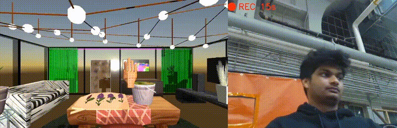

# VirtuHand: Real-time 3D Hand Gesture Recognition with Dynamic Motion Control


## Overview

VirtuHand is a sophisticated real-time hand gesture recognition system implementing a hybrid architecture that combines classical computer vision with deep learning approaches. The system leverages Intel RealSense D435i's depth sensing capabilities enhanced by Extended Kalman filtering for precise 3D tracking, while incorporating both MediaPipe-based gesture recognition and experimental ONNX neural network implementations for robust hand detection and pose estimation.

### Interactive Demo: Virtual Flower Arrangement


*📌 For full quality, watch the video on [YouTube](https://youtu.be/eRFWZjJbcgI)*

### Hand Articulation & Rigging Demo



## Core Features

### Advanced Hand Tracking & Depth Sensing
- **Depth Camera Integration**:
  - Intel RealSense D435i depth sensor (30 FPS, 640x480)
  - Multi-stage depth filtering pipeline
  - Sub-millimeter precision in optimal conditions
  - Custom depth data preprocessing and normalization

- **Extended Kalman Filter Implementation**:
  - 2D state vector (position, velocity) estimation
  - Optimized measurement and process noise matrices
  - Dynamic time-step handling (30Hz update rate)
  - Custom covariance tuning for hand motion characteristics
  - Advanced outlier rejection for robust tracking

- **3D Position Tracking**:
  - MediaPipe hand landmark detection (21 keypoints)
  - Palm center calculation using weighted landmark averaging
  - Geometric handedness determination using cross-product analysis
  - Quaternion-based rotation tracking with Kalman smoothing
  - Real-time coordinate space transformation

### Static Gesture Recognition System
- **Geometric Analysis Pipeline**:
  - Joint angle calculation using landmark triplets
  - Adaptive finger state detection with angle thresholds
  - Palm orientation analysis using normal vectors
  - Real-time confidence scoring system

- **Supported Gestures**:
  - GRAB: Finger curl analysis with palm-relative distances
  - OPEN_PALM: Extended finger validation with strict thresholds
  - PINCH: Precision thumb-index distance monitoring
  - POINT: Index extension with others closed detection

### Dynamic Gesture Recognition System
- **Custom Training Pipeline**:
  - Dataset: 20 sequences per gesture, 30 frames each
  - GRU architecture (input:63, hidden:32, layers:2)
  - Real-time sequence buffer management
  - Custom data augmentation for rotation invariance

- **Motion Pattern Analysis**:
  - Velocity component extraction (dx, dy)
  - Horizontal/vertical motion ratio analysis
  - Specialized pattern detectors:
    - SWIPE: Direction and magnitude validation
    - CIRCLE: Rotation and shape consistency checking
    - WAVE: Peak-valley detection with amplitude analysis

- **Performance Metrics**:
  - Recognition latency: <33ms
  - Gesture confidence threshold: 0.6
  - Minimum sequence length: 30 frames
  - Real-time smoothing with 5-frame minimum consistency


*Demonstration of supported gesture recognition*

### Neural Network Integration (Experimental)
- **ONNX-Based Hand Detection**:
  - Attempted replacement of MediaPipe's hand detection pipeline with ONNX models
  - Two-stage detection system:
    - Palm Detection (192x192 input)
    - Hand Landmark Detection (224x224 input)
  - Unity Barracuda engine integration for GPU acceleration
  - Custom tensor preprocessing pipeline
  - FP16 quantization for model optimization
- **Performance Targets**:
  - Palm Detection: 8-10ms inference time
  - Hand Landmark: 12-15ms inference time
  - Overall pipeline latency: < 33ms (30+ FPS)
  - Memory footprint: ~150MB during runtime

### Real-time Communication System
- **WebSocket Protocol**:
  - Asynchronous bidirectional communication
  - Custom JSON message protocol for gesture data
  - Optimized packet size (< 1KB per frame)
  - Auto-reconnection with exponential backoff
  - Ping-pong disabled for reduced latency
- **Data Flow**:
  - Hand position/rotation (30Hz)
  - Gesture classifications (real-time)
  - Joint angles for hand model
  - Dynamic gesture events

## Technical Architecture

### System Architecture
```
RealSense D435i Camera
       ↓
[Python Backend]
   ├─── Hand Detection (MediaPipe)
   ├─── Depth Processing (Kalman Filter)
   ├─── Gesture Recognition
   │    ├─── Static Gesture Detection
   │    │    └─── Geometric Analysis
   │    └─── Dynamic Gesture Detection
   │         ├─── GRU Model
   │         └─── Motion Pattern Analysis
   └─── WebSocket Server
           ↓
[Unity Frontend]
   ├─── WebSocket Client
   ├─── Hand Model & Joint System
   ├─── Flower Arrangement System
   └─── Physics Interaction System
         └─── Snapping & Animation

Real-time Data Flow:
Camera Feed → Detection → Processing → WebSocket → Unity Render
(30+ FPS)    (10-15ms)   (5-8ms)     (~1ms)      (16.6ms)
```

### Unity Integration
- **Hand Model**: Fully articulated hand model with inverse kinematics
- **Real-time Physics**: Dynamic object interaction and collision detection
- **Custom Shaders**: Advanced material rendering and effects
- **WebSocket Communication**: Low-latency data streaming protocol

## Installation and Usage

1. **Clone the Repository**
```bash
git clone https://github.com/Srecharan/VirtuHand.git
cd VirtuHand
```

2. **Unity Setup**
   - Download and install Unity 2022.3.5f1
   - Import required packages from Package Manager:
     - Native WebSocket
     - Barracuda
     - Intel RealSense SDK
   - Choose one of the following options:
     - Open the existing HandGestureTest2 scene from the project
     - Create a new scene and import objects from project assets
     - Create a new scene and import assets from Unity Asset Store

3. **Run the Backend**
```bash
# Start the Python server
python tests/test_server.py
```
After running the server, switch to Unity and enter Game mode to begin hand tracking.

**Important Notes:**
- Hand Model Setup:
  - Ensure proper rigging of all finger joints (21 points)
  - Each joint should have proper rotation constraints
  - Thumb requires special attention for natural movement
  - Configure inverse kinematics for realistic hand movement
- Script Attachment:
  - Attach HandGestureController.cs to the hand model
  - Configure WebSocket connection parameters
  - Set up gesture detection thresholds
- Camera Setup:
  - Position Intel RealSense D435i camera at appropriate height
  - Ensure proper lighting for optimal tracking

## Project Structure
```
VirtuHand/
├── src/
│   ├── camera/
│   │   └── realsense.py          # RealSense camera interface
│   ├── communication/
│   │   └── websocket_server.py   # WebSocket implementation
│   ├── gesture/
│   │   ├── classifier.py         # Static gesture recognition
│   │   ├── detector.py          # Hand detection & tracking
│   │   ├── dynamic_gesture.py   # Dynamic gesture system
│   │   ├── depth_utils.py       # Depth processing
│   │   └── train_dynamic_gestures.py  # Training pipeline
│   └── utils/
│       └── visualization.py      # Debug visualization
├── HandGestureInteraction/
│   └── Assets/
│       └── Scripts/
│           ├── HandGestureController.cs    # Main Unity controller
│           ├── ONNXHandGestureController.cs # ONNX integration
│           └── NeuralNetworkCreator.cs     # Model initialization
├── models/
│   └── best_dynamic_gesture_model.pth   # Trained GRU model
├── dataset/
│   └── dynamic_gestures/    # Training data
├── model_export/
│   ├── export_models.py     # ONNX conversion
│   └── download_models.py   # Model management
└── configs/                 # Configuration files
```

## Acknowledgments
- [MediaPipe Hand Landmark Detection](https://ai.google.dev/edge/mediapipe/solutions/vision/hand_landmarker) by Google
- Unity Technologies and Unity Asset Store
- Intel RealSense SDK
- Unity ML-Agents

## License
This project is licensed under the MIT License - see the LICENSE file for details