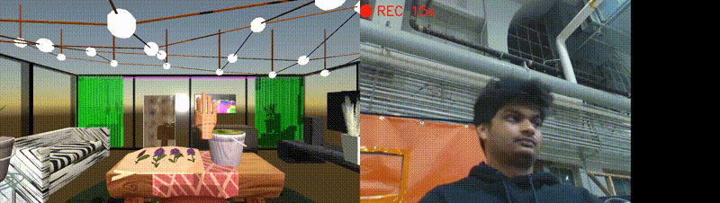

# VirtuHand: Real-time 3D Hand Gesture Recognition with Dynamic Motion Control


VirtuHand is a sophisticated real-time hand gesture recognition system implementing a hybrid architecture combining classical computer vision techniques with deep learning approaches. The system utilizes Intel RealSense D435i's depth sensing capabilities enhanced by Kalman filtering for precise 3D tracking, while incorporating both MediaPipe-based gesture recognition and experimental ONNX neural network implementations for robust hand detection and tracking.

## Demo Video
[](https://youtu.be/6AL6A1Zi3Gc)

### Quick Demo Preview


### Key Demo Features
The demo showcases:
- Real-time hand tracking using Intel RealSense D435i
- Dynamic gesture recognition with temporal analysis
- Physics-based interactions in Unity environment
- Seamless object manipulation (grab, move, place)
- Real-time swipe gesture controls
- Day/Night cycle control using pinch gestures
- Position-aware snapping system for flower arrangement

## Technical Stack
Core Technologies

Depth Sensing: Intel RealSense D435i with custom depth filtering
State Estimation: Extended Kalman Filter for 3D position refinement
Neural Networks: MediaPipe Hand Tracking + ONNX runtime optimization
Real-time Communication: WebSocket-based client-server architecture

Key Components

Depth Processing Pipeline

RealSense SDK integration (pyrealsense2)
Multi-stage depth filtering
Kalman filter-based depth smoothing
Custom depth-aware gesture recognition


Neural Network Implementation

ONNX model conversion and optimization
Unity Barracuda engine integration
Real-time tensor preprocessing
GPU-accelerated inference pipeline


Gesture Recognition System

Static gesture classification (GRAB, OPEN_PALM, PINCH, POINT)
Dynamic gesture detection using temporal analysis
Custom-trained sequence models
Real-time confidence scoring


Unity Integration

WebSocket-based real-time data streaming
Custom shader implementation
Physics-based interaction system
Dynamic animation control

## Key Features

- **Real-time Hand Tracking**
  - Sub-millimeter accurate tracking using RealSense D435i
  - Full 3D position and orientation mapping
  - Robust finger joint tracking and gesture recognition

- **Dynamic Gesture Recognition**
  - Custom-trained models for dynamic gesture detection
  - Supports swipe gestures with natural motion physics
  - Real-time gesture confidence scoring
  - Hand velocity and trajectory analysis

- **Static Gesture Recognition**
  - Four primary gestures: GRAB, OPEN_PALM, PINCH, POINT
  - High-precision finger state detection
  - Kalman filtering for smooth tracking

- **Interactive Demo Environment**
  - Real-time physics-based interactions
  - Natural object manipulation (grab, move, place)
  - Dynamic environment controls (day/night cycle)
  - Position-aware object snapping system

## Technical Architecture

### Core Pipeline
```
RealSense D435i → Python Backend → WebSocket Server → Unity Frontend
                    ↓
            Gesture Processing
                    ↓
         Position/Depth Mapping
```

### Neural Network Pipeline (Experimental)
```
Image Input → Palm Detection (192x192) → Hand Landmark Detection (224x224)
              ↓                          ↓
        ONNX Runtime              Barracuda Engine
              ↓                          ↓
        Gesture Classification    3D Position Mapping
```

## Implementation Details

### Hand Tracking and Gesture Recognition
- Custom MediaPipe integration for initial hand detection
- Dynamic gesture recognition using temporal sequence analysis
- Kalman filtering for depth and position smoothing
- WebSocket-based real-time communication protocol

### Neural Network Integration
- ONNX model conversion pipeline for optimized inference
- Unity Barracuda integration for GPU acceleration
- Custom tensor preprocessing for real-time performance
- Experimental edge computing capabilities

### Custom Training Pipeline
- Manually collected dataset for dynamic gestures
- Custom training pipeline for gesture sequence recognition
- Data augmentation and preprocessing workflows
- Model validation and performance optimization

### Unity Integration
- Custom shader development for hand visualization
- Physics-based interaction system
- Real-time gesture-based animation system
- Advanced object manipulation and snapping system

## Technical Requirements

### Hardware
- Intel RealSense D435i Camera
- CUDA-capable GPU (for neural network pipeline)
- 16GB RAM recommended

### Software
- Python 3.8+
- Unity 2022.3.5f1
- CUDA 11.2 & cuDNN 8.9
- See `environment.yml` for complete dependencies

## Installation

1. **Environment Setup**
```bash
# Clone the repository
git clone https://github.com/yourusername/VirtuHand.git
cd VirtuHand

# Create conda environment
conda env create -f environment.yml
conda activate virtuhand
```

2. **Unity Setup**
- Open the project in Unity 2022.3.5f1
- Import required packages from Package Manager
- Open HandGestureTest2 scene
- Configure RealSense camera settings

3. **Start the Application**
```bash
# Start the Python backend
python test_server.py

# Run Unity scene
```

## Project Structure
```
VirtuHand/
├── src/
│   ├── gesture/          # Gesture recognition modules
│   ├── camera/           # Camera handling
│   └── communication/    # WebSocket implementation
├── HandGestureInteraction/
│   ├── Assets/
│   │   ├── Scripts/      # Unity C# scripts
│   │   └── Scenes/       # Unity scenes
├── models/               # Trained models
└── tests/               # Test scripts
```

## Acknowledgments
- Intel RealSense SDK
- MediaPipe Framework
- Unity ML-Agents

## License
This project is licensed under the MIT License - see the LICENSE file for details.